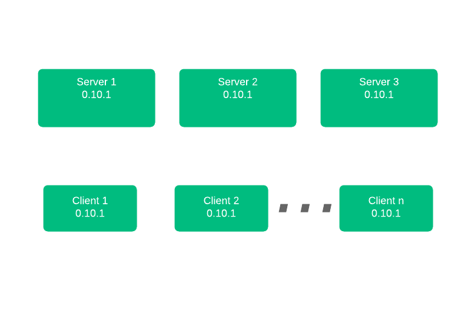
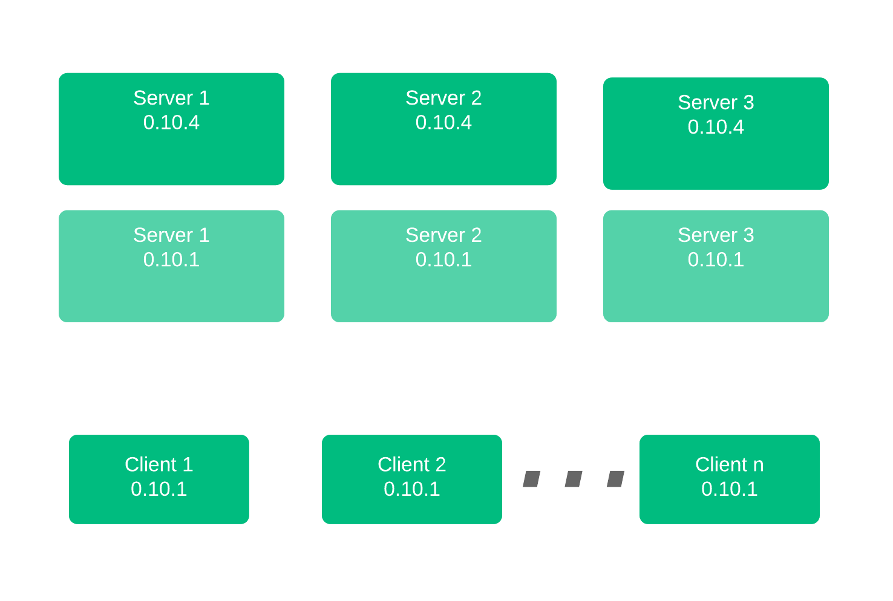

name: chapter-title
class: title, shelf, no-footer, fullbleed
background-image: url(https://hashicorp.github.io/field-workshops-assets/assets/bkgs/HashiCorp-Title-bkg.jpeg)
count: false

# Chapter 5
## Nomad Enterprise Platform

???
* This chapter discusses the features of the Nomad Enterprise Platform (see https://www.hashicorp.com/products/nomad/pricing/ and https://nomadproject.io/docs/enterprise/#nomad-enterprise-platform)
* This includes:
  * Nomad's ability to automatically upgrade an entire cluster of Nomad servers in an automatic and controlled fashion. This can sometimes be referred to as "upgrade migration"
  * Enhanced Read Scalability
  * Redundancy Zones

---
layout: true

.footer[
- Copyright © 2020 HashiCorp
- 
]

---
name: Nomad Enterprise Features - Autopilot
# Nomad Enterprise - Autopilot

* [Autopilot](https://learn.hashicorp.com/nomad/operating-nomad/autopilot) is a function that enables multiple features:
    * [Automated Upgrades](https://nomadproject.io/docs/enterprise/#automated-upgrades)
    * [Enhanced Read Scalability](https://nomadproject.io/docs/enterprise/#enhanced-read-scalability)
    * [Redundancy Zones](https://nomadproject.io/docs/enterprise/#redundancy-zones)

???
- Autopilot enables multiple features within Nomad Enterprise.
- This section focuses on Automated Upgrades, Read Scalability, and Redundancy Zones

---
name: Automated Upgrade Overview
# Automated Upgrade Process

* Add new servers to a cluster with updated versions.
* Autopilot won't promote new servers until a quorum is achieved.
* Once a quorum is achieved, Autopilot pomotes new servers and demotes old ones.
* Autopilot can remove old servers from the cluster automatically.
* Your upgrade is complete!

???
- This section discusses Nomad's ability to automatically upgrade an entire cluster of Nomad servers in an automatic and controlled fashion.
- Sometimes be referred to as "upgrade migration"

---
class: smaller
name: Automated Upgrade Flow 1
# Upgrade Process
* Existing Cluster, all on 0.10.1

???
- This section discusses Nomad's ability to automatically upgrade an entire cluster of Nomad servers in an automatic and controlled fashion.
- Sometimes be referred to as "upgrade migration"
- Starting with a basic cluster, all on the same version

---
class: smaller
name: Automated Upgrade Flow 2
# Upgrade Process
* Existing Cluster, all on 0.10.1
* New Servers Introduced Running 0.10.4

???
- New Servers are introduced with newer version
- Great use of Terraform

---
class: smaller
name: Automated Upgrade Flow 3
# Upgrade Process
* Existing Cluster, all on 0.10.1
* New Servers Introduced Running 0.10.4
* Quorum Achieved, Old Servers Demoted

???
- Once enough new servers are introduced, quorum achieved
- Nomad automatically demotes old servers
- Note:  This is default operation and can be overridden

---
class: smaller
name: Automated Upgrade Flow 4
# Upgrade Complete
* Existing Cluster, all on 0.10.1
* New Servers Introduced Running 0.10.4
* Quorum Achieved, Old Servers Demoted
* Old Servers Removed

???
- Once the new servers have been promoted old servers can be decommissioned
- And clients can be upgraded to the new version.

---
name: Scaling Readbility
# Enhanced Read Scalability

* Add non-voting servers to a cluster.
* They receive replicated data but are never promoted.
* This improves scheduling abilities and read performance.
* This is configured in the `server` stanza with the `non_voting_server` parameter.

???
* Enhanced Read Scalability allows additional non-voting servers in a Nomad cluster.
---
name: Nomad Redundancy Zones
# Nomad Redundancy Zones

* Without Redundancy Zones
    * Server Cluster in each Availability Zone (3-5 machines per zone)
    * Or give up redundancy with a single Server in each Zone
* With Redundancy Zones
    * Servers are associated with Availability Zones.
    * Nomad keeps one voting server in each zone.
    * Nomad also keeps one non-voting server in each zone.
    * Cluster Functionality retained across availabity zone failures.

???
- Redundancy Zones allows servers to be associated with a zone, and enables clusters to communicate across zones
- Without Redundancy Zones, each Zone would have an independent cluster, or just forego server redundancy
- Using Nomad Autopilot with Redundancy Zones ensures cluster operation continuity in the event of zone failures

---
name: chapter-Summary
# 📝 Chapter 5 Summary

In this chapter you did the following:
* Learned about the features of the Nomad Enterprise Platform:
  * Automated Upgrades
  * Enhanced Read Scalability
  * Redundancy Zones

???
* You now know a lot more about the Nomad Enterprise Platform than you did yesterday.
