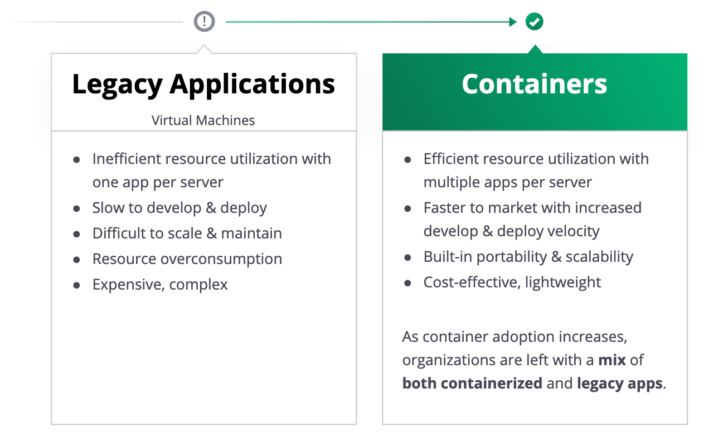

name: nomad-overview
class: title, shelf, no-footer, fullbleed
background-image: url(https://hashicorp.github.io/field-workshops-assets/assets/bkgs/HashiCorp-Title-bkg.jpeg)
count: false

# Chapter 1
## Nomad Overview

???
* In this chapter, we'll provide an overview of Nomad

---
layout: true

.footer[
- Copyright © 2020 HashiCorp
- 
]

---
name: chapter-1-topics
# Chapter 1 Topics

1. Nomad's Place in the HashiStack
1. Nomad's Business Value
1. What is Nomad?
1. Nomad Use Cases
1. Nomad OSS Features
1. Nomad Enterprise Features

???
- Topics discussed in Chapter 1

---
name: chapter-1-nomad-place-in-hashistack
# Nomad's Place in the HashiStack
.center[]

???

- Organizations can use Nomad to run their containerized workloads across any cloud or onprem.

---
name: chapter-1-nomad-business-value
# Nomad's Business Value
.center[]

???
-  Lowers total cost of ownership (TCO) via bin packing
-  Runs both containerized and legacy apps (e.g. Java classes and jars)
-  Easy to operate and maintain

---
name:  chapter1-what-is-nomad
# What is Nomad
.smaller[
* A flexible, lightweight, high performing, easy to use orchestrator
* Used to deploy and manage containers and legacy applications simultaneously
* Works across data centers and cloud platforms, providing universal scheduling
* Manages services, batch functions, as well as global system services
]

???
- Runs as a single binary in just about any environment - one of the easiest and lightweight service scheduler and manager available.
-  Used to deploy both container applications, as well as legacy applications such as Java or raw executables.
-  As an independent function, Nomad can run and communicate across data centers, and cloud platforms.  Truly cloud agnostic.
-  Can manage individual services, batch functions, or even global system services such as monitoring functions.

---
name: chapter-1-nomad-use-cases
# Nomad Use Cases
.center[]

???
- Container Workloads
- Legacy Applications
- Batch Jobs like Machine Learning

---
name: chapter-1-nomad-oss-features
# Nomad Open Source Features
.smaller[
* Flexible Task Drivers
* Device Plugins
* Apache Spark Integration
* NVIDIA GPU Support
* Service/Batch Schedulers
* Access Control System
* Web UI
* Consul & Vault Integration
* Multi-Upgrade Strategies
* Multi-Region Federation
]

???
- Task drivers like docker, java, exec
- Device Plugins allow community members to extend Nomad functionality to other drivers and devices
- Direct Apache Spark Integration for big data processing
- NVIDIA GPU Support enables compute-intensive workloads employing accelerators like GPUs or TPUs
- Service and Batch Schedulers enable both short and long-lived workloads
- ACLs to control access to data and APIs
- Web UI included out-of-the-box
- Native integration with other HashiCorp products Consul and Vault
- Enables upgrade strategies such as blue-green and canary
- Nomad Clusters can be extended across multiple cloud regions and on-prem datacenters

---
name: chapter-1-nomad-enterprise-features
class: compact, smaller
# Nomad Enterprise Features
.smaller[
* All Open Source Features
* Automated Upgrades
* Enhanced Read Scalability
* Redundancy Zones
* Namespaces
* Resource Quotas
* Preemption
* Sentinel Policies
]

???
- All Open Source Features are included in Enterprise
- Autopilot Upgrades
- Servers can act as a non-voting member of the cluster to help provide read scalability
- Nomad attempts to parition servers according to specified redundancy zone, and will aim to keep one voting server per zone
- Segregate workloads using Namespaces
- Quotas limit resource consumption across teams or projects to reduce waste and align budgets
- A shared cluster can be partitioned into multiple namespaces which allow jobs and their associated objects to be isolated from each other and other users of the cluster
- Preemption enables Nomad's scheduler to automatically evict lower priority allocations of service and batch jobs so that allocations from higher priority jobs can be placed.
- Sentinel defines policies such as disallowing jobs to be submitted to production on Fridays or only allowing users to run jobs that use pre-authorized Docker images
